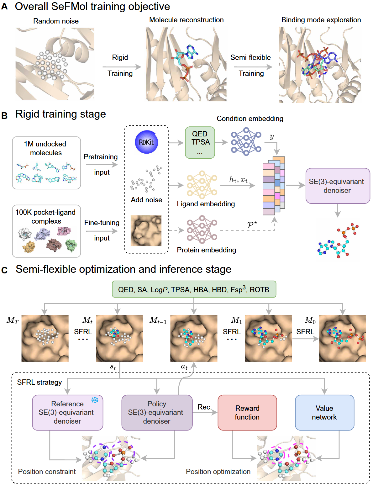
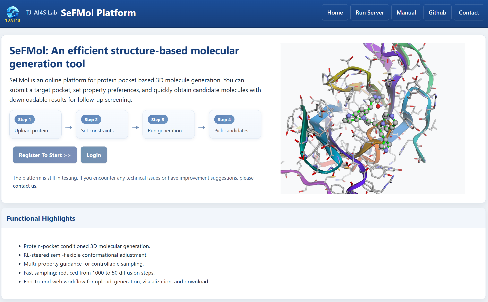
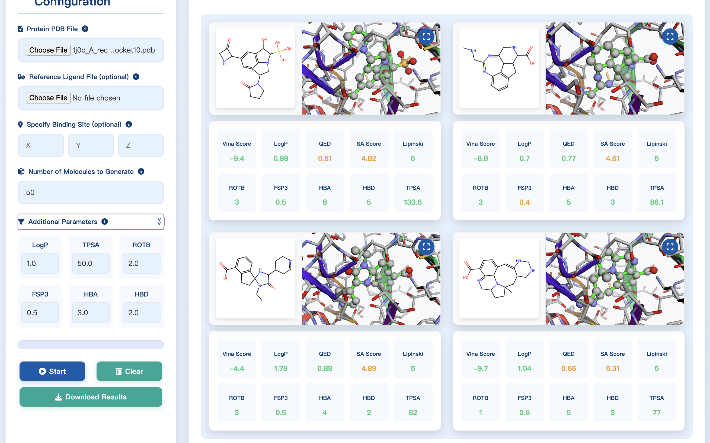
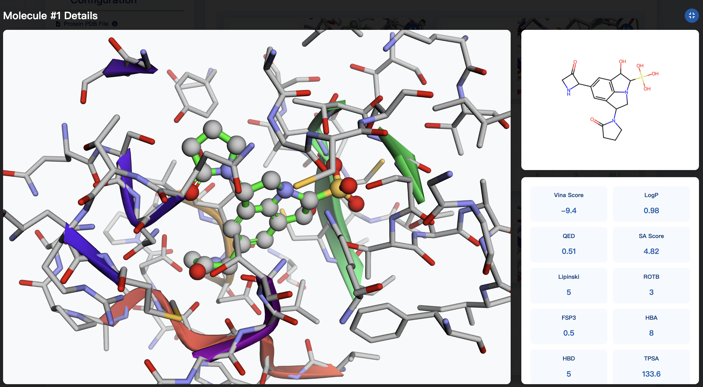

# SeFMol: Steering Semi-flexible Molecular Diffusion Model for Structure-Based Drug Design with Reinforcement Learning


Official repository for the paper "Steering Semi-flexible Molecular Diffusion Model for Structure-Based Drug Design with Reinforcement Learning". 

<div style="text-align: center;">
    
</div>


## Key Features
- **Two-Stage Rigid Training**: Combines property-biased pretraining on Molecule3D dataset with target-aware fine-tuning on protein-ligand pairs

- **RL-Optimized Semi-Flexibility**: Models denoising as Markov decision process with KL-constrained policy network for semi-flexible conformation exploration

- **20x Faster Sampling**: Revolutionary fast training-free sampling strategy reducing steps to 1/20th of conventional diffusion models

- **Sparse Reward Solution**: Addresses sparse affinity signals through property-conditioned reinforcement learning

- **User-friendly Platform**: Integrated visualization interface


## Platform Preview
We're developing a comprehensive platform for molecular design and visualization. The complete platform will be released upon paper acceptance.

<p align="center">
   
</p>

---

<p align="center">
   
</p>

---

<p align="center">
   
</p>

## Installation

### Prerequisites
- Conda package manager
- NVIDIA GPU (recommended)

### Create Environment
```bash
conda create -n SeFMol python=3.9
conda activate SeFMol
```

### Install Dependencies
```bash
# Install PyTorch with CUDA 11.7
conda install pytorch==1.13.1 pytorch-cuda=11.7 -c pytorch -c nvidia

# Install molecular modeling dependencies
conda install -c conda-forge pdbfixer
conda install conda-forge::openbabel
conda install pyyaml easydict python-lmdb -c conda-forge

# Install Python packages
pip install protobuf==5.27.1
pip install networkx==3.2.1
pip install rdkit==2023.9.6
pip install biopython==1.83

# For Vina Docking
pip install meeko==0.1.dev3 scipy pdb2pqr vina==1.2.2 
python -m pip install git+https://github.com/Valdes-Tresanco-MS/AutoDockTools_py3

# For EDeN
pip install git+https://github.com/fabriziocosta/EDeN.git --user
```

## Data Preparation
Download required datasets from [Google Drive folder](https://drive.google.com/drive/folders/1j21cc7-97TedKh_El5E34yI8o5ckI7eK?usp=share_link):

**For training:**
- `crossdocked_v1.1_rmsd1.0_pocket10_processed_final.lmdb`
- `crossdocked_pocket10_pose_split.pt`

**For evaluation:**
- `test_set.zip` (unzip before use)

## Training

### 1. Rigid Pre-training
```bash
python train_rigid_pt.py
```

### 2. Rigid Fine-tuning
```bash
python train_rigid_ft.py
```

### 3. Semi-flexible Training
```bash
python train_sfrl.py
```

## Sampling
```bash
python sample.py \
  --config configs/rl.yml \
  --start_index 0 \
  --end_index 99 \
  --timesteps 50 
```
#### `--timesteps` Argument

| Property        | Value                          |
|-----------------|--------------------------------|
| **Range**       | `10` to `1000` (controls diffusion steps) |
| **Recommendation** | `50` (optimal speed/quality balance) |
| **Performance** | **20x faster** than default (1000 steps)<br> **No detectable quality loss** |


## Evaluation
Evaluate generated molecules:
```bash
python eval_split_diff.py
```

## Coming Soon
- Complete visualization platform
- Pre-trained model weights
- Tutorial notebooks
- Docker image for easy deployment

## Citation
Our paper is under review, if you find our code helpful, please cite 

```bibtex
@misc{SeFMol2025,
title = {Steering Semi-flexible Molecular Diffusion Model for Structure-Based Drug Design with Reinforcement Learning},
author = {Zhang, Xudong and Qu, Sanqing and Lu, Fan and Wang, Jianmin and Tian, Zhixin and Gu, Shangding and Zhang, Yanping and Knoll, Alois and Gao, Shaorong and Chen, Guang and Jiang, Changjun},
year = {2025},
publisher = {GitHub},
journal = {GitHub repository},
howpublished = {\url{https://github.com/ispc-lab/SeFMol}},
}

```
