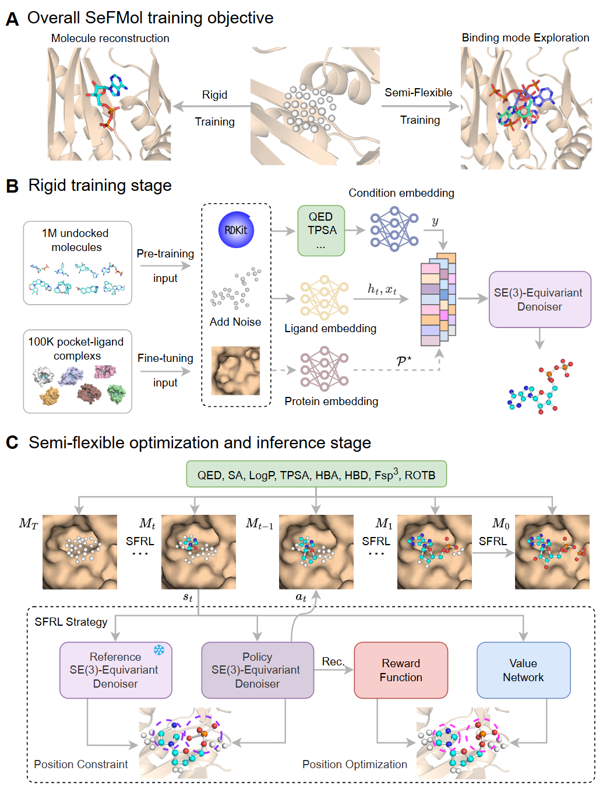

# SeFMol: Steering Semi-flexible Molecular Diffusion Model for Structure-Based Drug Design with Reinforcement Learning


Official repository for the paper "Steering Semi-flexible Molecular Diffusion Model for Structure-Based Drug Design with Reinforcement Learning". SeFMol achieves state-of-the-art performance in generating high-affinity drug molecules by combining semi-flexible molecular modeling with reinforcement learning.



## Key Features
- 🧠 **Two-Stage Rigid Training**: Combines property-biased pretraining on Molecule3D dataset with target-aware fine-tuning on protein-ligand pairs

- 🤖 **RL-Optimized Semi-Flexibility**: Models denoising as Markov decision process with KL-constrained policy network for semi-flexible conformation exploration

- ⏩ **20x Faster Sampling**: Revolutionary fast training-free sampling strategy reducing steps to 1/20th of conventional diffusion models

- 📊 **Sparse Reward Solution**: Addresses sparse affinity signals through property-conditioned reinforcement learning

- 💻 **User-friendly Platform**: Integrated visualization interface (coming soon!)


## Performance Comparison
SeFMol outperforms existing methods on key molecular metrics:

| Method       | Vina Score (↓) |       | Vina Min (↓) |       | Vina Dock (↓) |       | High Affinity (↑) |       | QED (↑) |       | SA (↑) |       | Lipinski (↑) | Diversity (↑) |
|--------------|----------------|-------|--------------|-------|---------------|-------|-------------------|-------|---------|-------|--------|-------|--------------|---------------|
|              | Avg.           | Med.  | Avg.         | Med.  | Avg.          | Med.  | Avg.              | Med.  | Avg.    | Med.  | Avg.   | Med.  | Avg.         |               |
| Reference    | -6.36          | -6.46 | -6.71        | -6.49 | -7.45         | -7.26 | -                 | -     | 0.48    | 0.47  | 0.73   | 0.74  | 4.27         | -             |
| AR           | -5.75          | -5.64 | -6.18        | -5.88 | -6.75         | -6.62 | 37.9%             | 31.0% | 0.51    | 0.50  | 0.63   | 0.63  | 4.75         | 0.690         |
| Pocket2Mol   | -5.14          | -4.70 | -6.42        | -5.82 | -7.15         | -6.79 | 48.4%             | 51.0% | 0.56    | 0.57  | 0.74   | 0.75  | 4.88         | 0.685         |
| ResGen       | 10.50          | 2.54  | -2.94        | -4.41 | -6.59         | -6.45 | 38.0%             | 25.0% | 0.58    | 0.59  | **0.78** | **0.79** | 4.90         | 0.742         |
| FLAG         | 45.98          | 36.62 | 6.17         | -2.91 | -5.24         | -5.71 | 27.9%             | 5.0%  | 0.61    | 0.62  | 0.63   | 0.62  | **4.98**     | **0.766**     |
| TargetDiff   | -5.47          | -6.30 | -6.64        | -6.83 | -7.80         | -7.91 | 58.1%             | 59.1% | 0.48    | 0.48  | 0.58   | 0.58  | 4.51         | 0.708         |
| DecompDiff   | -5.67          | -6.04 | -7.04        | -6.91 | -8.39         | -8.43 | 64.4%             | 71.0% | 0.45    | 0.43  | 0.61   | 0.60  | 4.31         | 0.660         |
| MolCRAFT     | -6.59          | -7.04 | -7.27        | -7.26 | -7.92         | -8.01 | 59.1%             | 62.6% | 0.50    | 0.51  | 0.69   | 0.68  | 4.46         | 0.718         |
| IPDiff       | -6.66          | -7.47 | -7.64        | -7.69 | -8.49         | -8.39 | 68.5%             | 72.2% | 0.50    | 0.51  | 0.56   | 0.56  | 4.40         | 0.728         |
| **SeFMol**   | **-7.23**      | **-7.70** | **-8.03**    | **-8.00** | **-8.72**     | **-8.75** | **68.7%**         | **76.3%** | **0.63** | **0.64** | 0.60   | 0.60   | 4.90         | 0.686         |

## Platform Preview
We're developing a comprehensive platform for molecular design and visualization. The complete platform will be released upon paper acceptance.

<p align="center">
   
</p>

## Installation

### Prerequisites
- Conda package manager
- NVIDIA GPU (recommended)

### Create Environment
```bash
conda create -n SeFMol python=3.9
conda activate SeFMol
```

### Install Dependencies
```bash
# Install PyTorch with CUDA 11.7
conda install pytorch==1.13.1 pytorch-cuda=11.7 -c pytorch -c nvidia

# Install molecular modeling dependencies
conda install -c conda-forge pdbfixer
conda install conda-forge::openbabel

# Install Python packages
pip install protobuf==5.27.1
pip install networkx==3.2.1
pip install rdkit==2023.9.6
pip install biopython==1.83
```

## Data Preparation
Download required datasets from our [Google Drive folder](https://drive.google.com/drive/folders/1j21cc7-97TedKh_El5E34yI8o5ckI7eK?usp=share_link):

**For training:**
- `crossdocked_v1.1_rmsd1.0_pocket10_processed_final.lmdb`
- `crossdocked_pocket10_pose_split.pt`

**For evaluation:**
- `test_set.zip` (unzip before use)

## Training Workflow

### 1. Rigid Pre-training
```bash
python train_rigid_pt.py
```

### 2. Rigid Fine-tuning
```bash
python train_rigid_ft.py
```

### 3. Semi-flexible Training
```bash
python train_sfrl.py
```

## Sampling Molecules
Generate molecules for a specific index range:
```bash
python sample.py --config configs/rl.yml --start_index 0 --end_index 99
```

## Evaluation
Evaluate generated molecules:
```bash
python eval_split_diff.py
```

## Coming Soon
- Complete visualization platform
- Pre-trained model weights
- Tutorial notebooks
- Docker image for easy deployment
